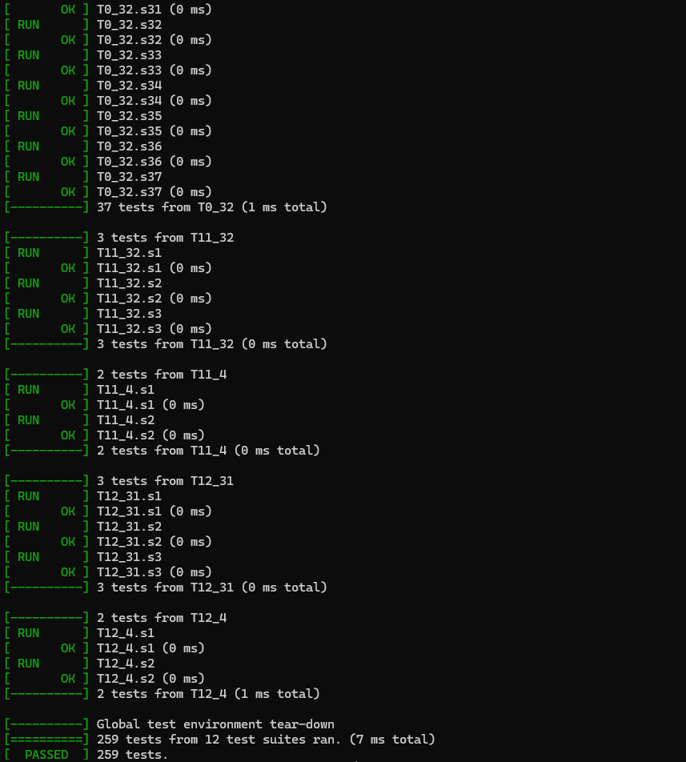

1. clone this porject to local enviroment

```
git clone this_project
```

2. install gtest

```
sudo apt-get install libgtest-dev
```

3. run the script to get results

```
cd  StateMachine
bash ./run.sh
```

```
the unit tests results will show up in terminal
```


4. generate the unit test report

   a. copy the results to /html_generator

   ```
   cp ./build/report.xml ./html_generator
   ```
   b. generate html report

   ```
   bash ./generate.sh
   ```
5. The results should be like:

   

   
